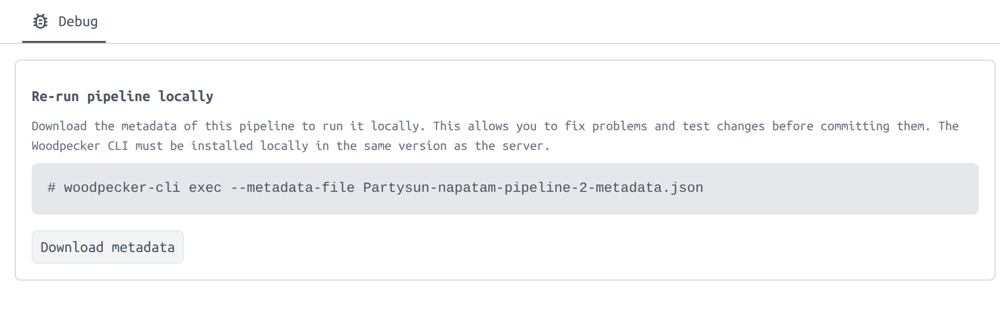

# Hello World Woodpecker

Создадим папку нашего проекта, папку для всех сценариев CI/CD и первый сценарий.

```bash
mkdir -p woodpecker-test/.woodpecker && touch woodpecker-test/.woodpecker/hello-world-flow.yml
```

Заполним файл сценария.

```yaml
when:
  - event: manual

steps:
  - name: build
    image: bash
    commands:
      - echo "This is the build step"
      - sleep 5
```

И мы уже готовы запустить наш сценарий для будущего CI/CD с помощью CLI woodpecker-cli.

```bash
woodpecker-cli exec
```

```bash
# hello-world-flow.yml
[build:L0:0s] + echo "This is the build step"
[build:L1:0s] This is the build step
[build:L2:0s] + sleep 5
```

Да, да! Таким образом существует в мире возможность начать проект не с инициализации через cargo new или npm create. А с того чтобы описать что вы решили собрать и протестировать и запустить.

Поговорим о yaml нашего workflow для woodpecker. Мы видим язык для определения шагов выполнения. Каждый шаг требует условия для запуска. И обычно условием будет что-то вроде

```yaml
when:
  - event: push
    branch: master-of-the-zoo

when:
  - event: [push, pull_request]
```

- [Примеры сценариев](https://codeberg.org/Codeberg-CI/examples/src/branch/main/Rust/.woodpecker.yaml)
- [Документация по синтаксису workflow](https://woodpecker-ci.org/docs/usage/workflow-syntax)

Мы не можем не указать никакого условия, шаг не будет исполнен. А если мы укажем pull-request или push,
woodpecker-cli локально тоже не станет запускать шаги. Есть несколько способов для запуска сразу, это использование условия

```yaml
- evaluate: "true"
```

Либо CI_PIPELINE_EVENT=manual, что дает больше информации о том что происходит.
Можно передать любую другую env при вызове и сделать проверку.
Еще вариант указать event как manual. Собственно то, что и надо использовать.

```yaml
when:
  - event: [push, pull_request]
    branch: master
  - event: manual
```

Если сборка завалилась уже на сервере woodpecker, то можно через UI или CLI скачать metadata файл, который, переданный через аргумент при запуске сценария, будет содержать информацию о том, что произошло событие пуша нового коммита, и сценарий также будет выполнен.



```bash
 woodpecker-cli exec --metadata-file Partysun-napatam-pipeline-2-metadata.json
```

Вернемся к нашему yaml для сценария, там есть еще одна магия, которую надо понять.
[Local Backend](https://woodpecker-ci.org/docs/administration/configuration/backends/local)

Агент Woodpecker может запустить код в контейнерах Docker, k8s и запускать сценарии в среде bash/fish локально на системе, где установлен агент Woodpecker. Локальный запуск опасен, и стоит понимать возможные риски для системы.

Когда мы используем локальный backend для запуска сценария, параметр image используется для выбора того, какой shell (Bash или Fish) будет использован для запуска команд.
